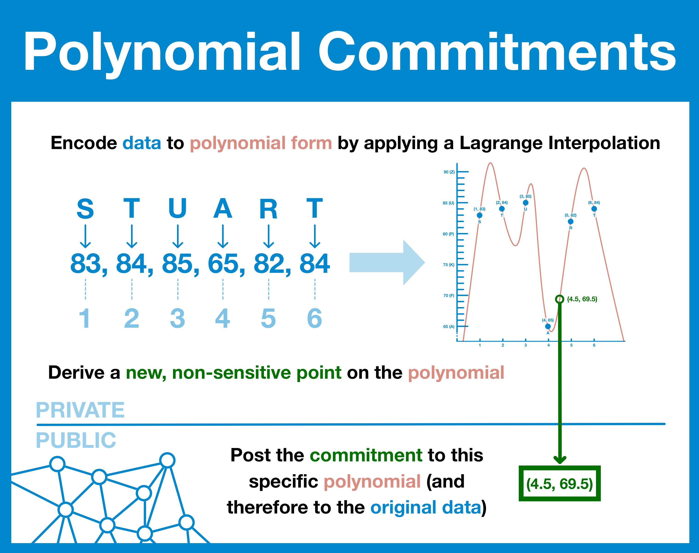

# Week 2 - More Crypto, SNARKs, and STARKs

## Practical

### Circom Crash Course (build from command line; ZKU course)
### Write a circuit for a token mixer

## Study

### KZG Polynomial Commitments (keep this simple and black-boxed)

Polynomial Commitments are cryptographic tools that allow the hiding of some coefficients while revealing others. They're used in various cryptographic proofs and blockchain protocols. For a better understanding of Polynomial Commitments
The intuition of KZG is that it is a commitment scheme. It is used to commit to a polynomial and later reveal a certain point on that polynomial. All your input data "lock" a specific polynomial.

Read this article for an introduction:
- [KZG Commitments by Inevitable Ethereum](https://www.inevitableeth.com/home/concepts/kzg-commitment)

Read this article for a more in-depth mathematical look into how it works (optional):
- [KZG polynomial commitments by Dankrad Feist](https://dankradfeist.de/ethereum/2020/06/16/kate-polynomial-commitments.html)

If you prefer to read some code, check out this article:
- [Explaining KZG Commitment with Code Walkthrough by Kai Jun Eer](https://kaijuneer.medium.com/explaining-kzg-commitment-with-code-walkthrough-216638a620c9)

### Trusted Setups

TODO - Expand this section, keep it black-boxed, and reference Inevitable Ethereum

### STARKs and SNARKs

TODO - Write a section giving an overview of these two.

### From Computation to ZKPs

TODO - use ONLY Vitalik's blog post; arithmetic circuits, R1CS, QAP. Mention pinocchio but only in a historical manner.

### Groth16 (keep this simple and black-boxed)

### STARKs and FRI

https://vitalik.eth.limo/general/2017/11/09/starks_part_1.html

https://vitalik.eth.limo/general/2017/11/22/starks_part_2.html