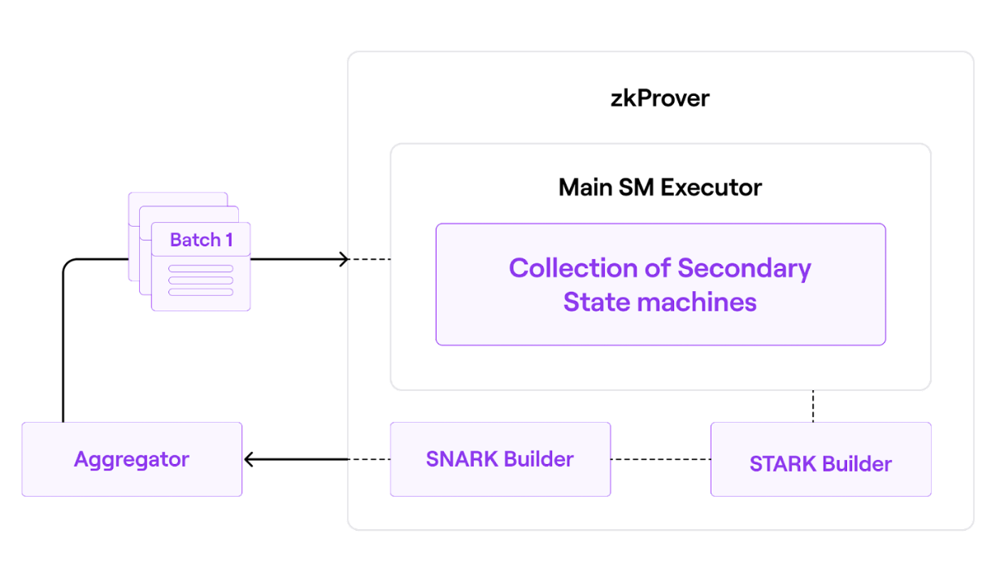
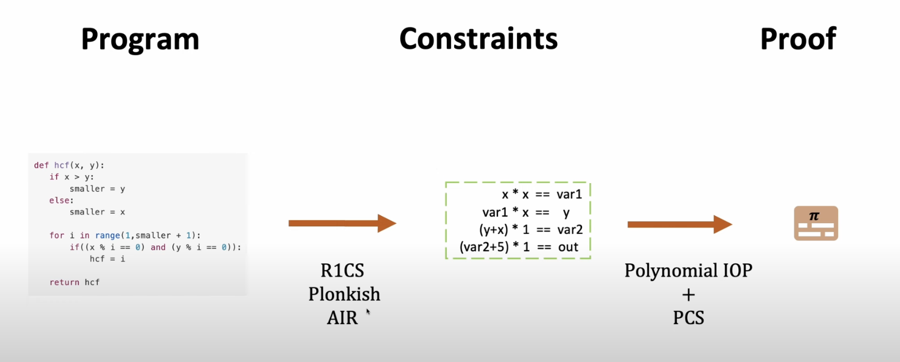
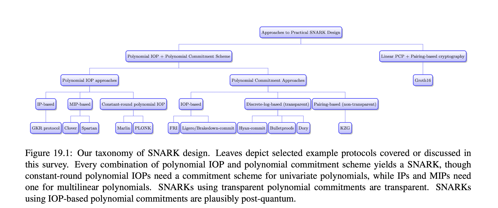

# Week 2 - More Crypto, SNARKs, and STARKs

## Practical

### Circom Crash Course (build from command line; ZKU course)

There are [excellent resources available like ZKU course](https://zku.gnomio.com/) to learn Circom. [The week 2 of ZKU course](https://zku.gnomio.com/mod/assign/view.php?id=119) introduces the merkle tree and token mixer. Finish week2 part1 - Hashes and Merkle Tree and part2 - Tornado Cash. You may find the curated material useful to understand the concepts better. Semaphore is optional but recommended.

### Reference Material (optional)

1. https://circom.erhant.me/

## Study

### KZG Polynomial Commitments (keep this simple and black-boxed)

Polynomial Commitments are cryptographic tools that allow the hiding of some coefficients while revealing others. They're used in various cryptographic proofs and blockchain protocols. For a better understanding of Polynomial Commitments
The intuition of KZG is that it is a commitment scheme. It is used to commit to a polynomial and later reveal a certain point on that polynomial. All your input data "lock" a specific polynomial.

Read this article for an introduction:
- [KZG Commitments by Inevitable Ethereum](https://www.inevitableeth.com/home/concepts/kzg-commitment)

Read this article for a more in-depth mathematical look into how it works (optional):
- [KZG polynomial commitments by Dankrad Feist](https://dankradfeist.de/ethereum/2020/06/16/kate-polynomial-commitments.html)

If you prefer to read some code, check out this article:
- [Explaining KZG Commitment with Code Walkthrough by Kai Jun Eer](https://kaijuneer.medium.com/explaining-kzg-commitment-with-code-walkthrough-216638a620c9)

### Trusted Setup

Trusted setup is a process to generate a bunch of different points on elliptic curve. You can use these points with polynomial commitment schemes. Each point has same generator but different power. You can use these points to represent the variable terms in the polynomial. Therefore, the result of the polynomial commitment scheme with trusted setup is also a point on the elliptic curve. [Read this article by inevitable Ethereum to understand the concept better](https://www.inevitableeth.com/en/home/concepts/pcs-trusted-setup)

### STARKs and SNARKs

STARKs and SNARKs are two types of zero-knowledge proofs system. The proof system requires witness, initial statement, circuit. We'll explain them in the next section. Normally the proof generated is a bunch of byte and it's a few mathematic objects. The proof can be verified by the verifier by running some verification functions on these mathematic objects.

zkSTARK and zkSNARK are in fact adjectives. They describe the type of proof system. It doesn't necessarily need to be zk. You don't need to know the detail of how they work at the moment, but you need to know they are adjective to describe the proof system and when we say Blah Blah is a zkSNARKs, it means it's a proof system that requires a prover and a verifier, and the prover can prove something to the verifier without revealing the information.

1. Zero-Knowledge: Verifier cannot know what is verified except true/false.
2. Succinct: Proof needs to be short and can be verified quickly.
3. Non-Interactive: Prover and Verifier do not need to interact back and forth in order to verify.
4. ARgument: Need to match the nature of Soundness, almost impossible to lie to a Verifier.
5. (of) Knowledge: Knowledge is required to produce proof.

They can also be used together. Polygon zkEVM and zkSync Boojum, for example, uses zkSTARKs for individual proofs and zkSNARKs for the aggregated proof to "prove all the previous proofs are generated correctly", therefore aggregate several zkSTARKs.

[Source](https://docs.polygon.technology/zkEVM/architecture/)

You can also read [this article in 10 mins](https://medium.com/@ramsesfv/starks-vs-snarks-d2e09c4e6069) explains the really high level difference between STARKs and SNARKs.

### From Computation to ZKPs

There's a circuit diagram from [Vitalik's blog post](https://vitalik.eth.limo/general/2019/09/22/plonk.html), you will be asked to read it in week4. For now let's focus only on a diagram from the article. It's a circuit below. It's arithmetic, so the gate is addition and multiplication. This represents `x^3 + x + 5 = 35` and x is the only "input" here. It should be `3` to satisfy the gate. For the first gate, it should be `9` if you have to label the value for it. because `3 * 3 = 9`. All the values you label on the gate between are "witness". The answer and operation of each gate actually constrain the value of the witness, so this circuit is a constraint system. How to prove the circuit is correctly filled? You can either prove the gate correctly compute (gate constraint) or prove the neighbor gate (permutation constraint) is consistent. That's the main part of the proof. While in the formal proof system, all of your computation should be in polynomial.

The process of converting a program to a proof is:

1. convert program to a bunch of constraints, and your input have to satisfy these constraints. like `x * x = 16` then `x = 4` if x is an positive integer.
2. With this constraint and input number, you try to prove the constraint really satisfy. In the case of PLONK, the main part of your proof are every gate is correctly compute and every neighbor gate is consistent. You just compute it in polynomial. That's why it seems complicated.

You can apply many arithmetization techniques to convert a program to a proof. There are R1CS, Plonkish, AIR. You can also have different combination of proving scheme like Polynomial IOP and PCS in below diagram.

[Source](https://zk-learning.org/assets/lecture12.pdf)

There're really a lot of combinations like below taxonomy shows, but you don't need to know all of them at the moment.

[Source](https://people.cs.georgetown.edu/jthaler/ProofsArgsAndZK.pdf)

### Groth16 (keep this simple and black-boxed)

Groth16 is one of the famous zkSNARKs. Just remember that its biggest advantage of it is its proof size is small. That's why it's widely used in many blockchain projects. We won't learn the detail here, but you can read this article to understand how it works:
[Groth16](https://www.zeroknowledgeblog.com/index.php/groth16)

### STARKs and FRI

STARKs are a type of zero-knowledge proof system that is post-quantum secure. It usually involves larger proof size and faster proof size. There are two articles written by Vitalik that explain STARKs in detail. You can read them here:
1. https://vitalik.eth.limo/general/2017/11/09/starks_part_1.html
2. https://vitalik.eth.limo/general/2017/11/22/starks_part_2.html
3. **Optional article**: https://vitalik.eth.limo/general/2018/07/21/starks_part_3.html

####  Optional Resources (For Deepening Your Understanding)

- **[Stark Anatomy](https://aszepieniec.github.io/stark-anatomy/)**  
  This six-part tutorial series dives into the mechanics of the STARK proof system. It’s designed for a technically-inclined audience with a basic understanding of mathematics and programming.

- **[Exploring Circle STARKs](https://vitalik.eth.limo/general/2024/07/23/circlestarks.html)**  
  An introduction to Circle STARKs, an optimization that enhances the efficiency and scalability of STARK proofs using structured polynomial commitments.

# 💪 Exercises

1. What is a proof system?
2. What is input, witness, circuit, and proof? 
3. How does program convert to proof?
