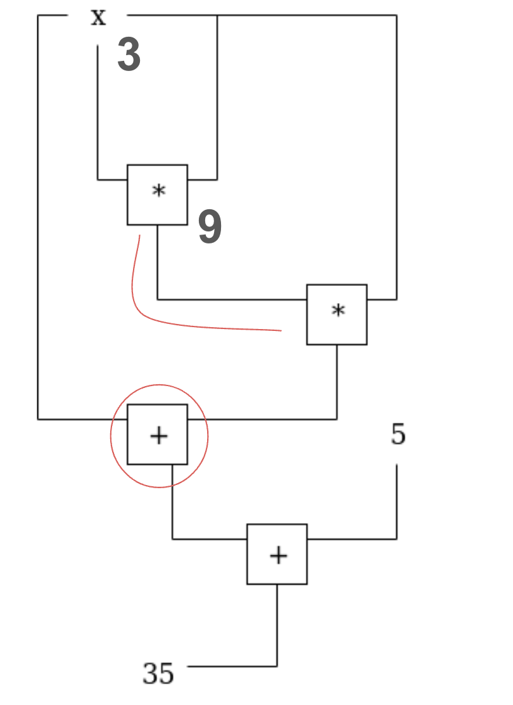

# Week 4 - PLONK

The exercise this week is required to do, your group have to publish a blogpost on PLONK and present at the end of week and finish Rustlings.

## Practical

Many zk proof systems are written in Rust. Learn Rust with [Rustlings](https://rustlings.cool/). It's a game with nearly 100 challenges. You are required to finish it.

## Study

When you start to learn ZK proof system, you are really advised to start from PLONK than any other proof system. There're a bunch of amazing articles out there, but instead of jumpping into rebbit hole, you should start from [Vitalik's blog post](https://vitalik.eth.limo/general/2019/09/22/plonk.html) and focus on reading it all.
With this article you can understand what is widely used plonkish style of circuit arithemization. For this article, you may be unable to understand all the details at once, but you should at least understand what does this diagram mean:

Look at PLONK from a slightly higher level perspective than the paper. [ZKP MOOC Lec 5](https://www.youtube.com/watch?v=A0oZVEXav24)

Read Plonkathon Referenced Version. If you want to challenge yourself, You can implement it.
https://github.com/0xPARC/plonkathon/tree/reference

### Reference Material (optional)

In order to understand PLONKathon, you might need to understand the following concepts, but only read it when you really feel like.

1. There's the [website for plonkathon](https://plonkathon.com/), at this moment, you should already understand elliptic curve, pairing. You might need to understand Fiat-Shamir heuristic and Fast Fourier Transform to understand the code. They also have [video play list explaining each stage](https://www.youtube.com/playlist?list=PLNK7oFq6eaEzHNYHpQ_zbgPEBDhLmyfFb)
2. Schwartz Zippel Lemma https://brilliant.org/wiki/schwartz-zippel-lemma/
3. Lagrange interpolation https://en.wikipedia.org/wiki/Lagrange_polynomial
4. FFT https://www.youtube.com/watch?v=h7apO7q16V0. Put it simply, FFT and Inverse FFT are turning polynomials from coefficient domain into evaluation domain and vice versa.
5. Fiat-Shamir heuristic. Put it simply, normally interactive proof is done by sending the challenge to the verifier and the verifier will send the challenge to the prover. It's a way to turn the interactive proof into non-interactive proof by hashing the existing computation trace and use it as the challenge. 
6. Library for PLONK implementaion: [Jellyfish](https://github.com/EspressoSystems/jellyfish), [Dusk-network](https://github.com/dusk-network/plonk)